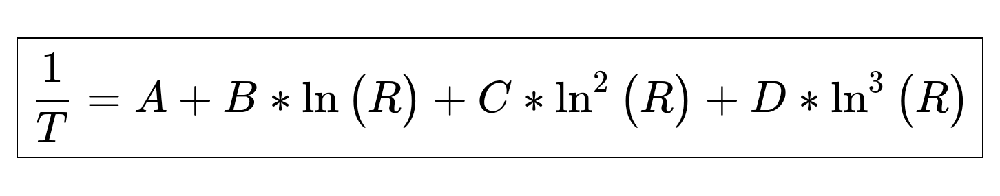
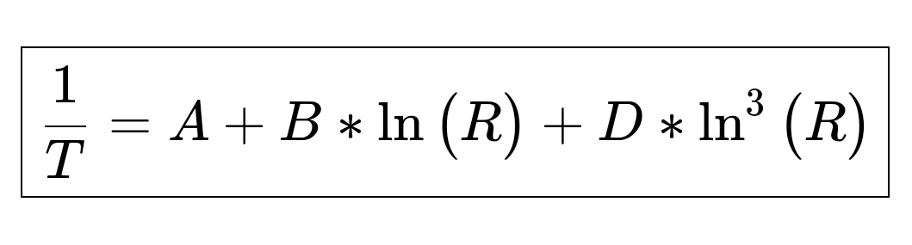
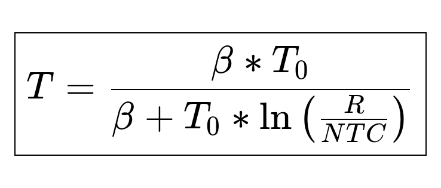
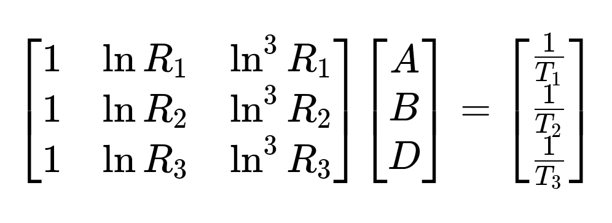

# ThermistorNTC library #

[](README.md)

Library to used to derive a precise temperature of a thermistor, fastest Calc. (14~29% faster than others)

## Introduction ##

The thermistor changes its resistance drastically with temperature.
"Thermistor" word comes from “thermally sensitive resistor". The resistance of ordinary
materials rises slightly as temperature rises, whereas NTC (negative
temperature coefficient) thermistors exhibit a sharp decrease in resistance.
For information about thermistor see manufacturer information.
Shibaura manufacturer has a lot of [thecnical information](https://www.shibauraelectronics.com/products/technical/index.html)
about NTC thermistors.

The Steinhart-Hart equation is the most widely used tool to interpolate
the NTC thermistor resistance/temperature curve. It is a third order
polynomial ecuation which provides very good curve fitting.

<p align=center></p>

In the standard Steinhart-Hart equation the C parameter is set to zero.
However, some manufacturers use all 4 coefficients. So we can use standard Steinhart-Hart
ecuation with 3 coefficients.

<p align=center></p>

where:
* **T** is the temperature (in kelvins),
* **R** is the resistance at T (in ohms),
* **A**, **B**, **C** and **D** are the Steinhart–Hart coefficients, which vary depending on the type and model of thermistor and the temperature range of interest.
These can usually be found in the data sheet.

## Other expressions ##

Other form of the equation is the use of B (beta) parameter

<p align=center></p>

where:
* **T** is the temperature (in kelvins)
* **T0** is 298'15 ºK (25 ºC)
* **R** is the resistance at T (in ohms),
* **NTC** is the resistence of thermistor at 298'15 ºK (25 ºC)
* **beta** is the Steinhart-Hart beta coefficient that vary depending on the type and model of Thermistor.
It can usually be found in the data sheet.

Some manufacturers have begun providing regression coefficients as an alternative to Steinhart–Hart coefficients.
See this document for more information. ["Comments on the Steinhart–Hart Equation"](http://www.bapihvac.com/wp-content/uploads/SHH_Equation_Comments.pdf)
(PDF). Building Automation Products Inc. 11 November 2015. Retrieved 8 July 2020.

The most general form of the equation can be derived from extending the B parameter equation to an infinite series:

<p align=center></p>

You can get more information in this document:
Matus, Michael (October 2011).
[Temperature Measurement in Dimensional Metrology](https://oar.ptb.de/files/download/56d6a9edab9f3f76468b4643)
– Why the Steinhart–Hart Equation works so well. MacroScale 2011. Wabern, Switzerland

## More Information ##

[Thermistor](https://en.wikipedia.org/wiki/Thermistor?wprov=sfla1) is the principal element of temperature sensor.

[Look here](https://en.wikipedia.org/wiki/Steinhart–Hart_equation?wprov=sfla1) for more information about Steinhart-Hart ecuations.

See this page for info about [NTC Thermistors Steinhart and Hart Equation](https://www.ametherm.com/thermistor/ntc-thermistors-steinhart-and-hart-equation)

You can learn more about [temperature coefficient here](https://en.wikipedia.org/wiki/Temperature_coefficient?wprov=sfla1).

More information:
* [Arrhenius equation](https://en.wikipedia.org/wiki/Arrhenius_equation?wprov=sfla1).
* [Q10 temperature coefficient](https://en.wikipedia.org/wiki/Q10_%28temperature_coefficient%29).

## Fast Calc ##

In this library, it is take the beta ecuation and calculate temperature of the thermistor from it.

<p align=center></p>

So we can solve using this formula:

<p align=center></p>

where:
* **T** is the temperature (in kelvins)
* **T0** is 298'15 ºK (25 ºC)
* **R** is the resistance at T (in ohms),
* **NTC** is the resistence of thermistor at 298'15 ºK (25 ºC)
* **beta** is the Steinhart-Hart beta coefficient that vary depending on the type and model of Thermistor.

The library is 14-29% faster than others libraries to
get temperature from Thermistor if we compare this library
with libraries based on beta equation. And it depends on the
board used. Tested on LGT8F328P-SOPP, LGT8F328P-QF32 and Arduino pro mini boards.
If it is compared Fast Calc with Steinhart-Hart three orden equation,
it is 35-44% faster, depends on microcontroller used. See example for test.

<p align=center></p>

Testing **sensor0** Steinhart-Hart three orden equation, **sensor1** Fast Calc equation. LGT8F328P-SOPP board. (32 MHz 5v.)

<p align=center></p>

Testing **sensor0** Steinhart-Hart three orden equation, **sensor1** beta equation and **sensor1_fast** Fast Calc equation. LGT8F328P-QF32 board. (32 MHz 5v.)

<p align=center></p>

Testing **sensor0** Steinhart-Hart three orden equation, **sensor1** beta equation and **sensor1_fast** Fast Calc equation. Atmega328p board. (16 MHz 5v.)

<p align=center></p>

Testing with 100k thermistors and 22kohms. Testing **sensor0** Steinhart-Hart three orden equation, **sensor1** beta equation and **sensor1_fast** Fast Calc equation. Atmega328p board. (16 MHz 5v.)

## Calculation of beta ##

Beta is measured in degrees Kelvin (K) and is computed based on this equation:

<p align=center></p>

Where:
* **Rt1** = Resistance at Temperature 1 (ohms)
* **Rt2** = Resistance at Temperature 2 (ohms)
* **T1** = Temperature 1 in (Kelvin)
* **T2** = Temperature 2 in (Kelvin)

How to Calc beta of NTC Thermistor, you can [see this page.](https://www.ametherm.com/thermistor/ntc-thermistor-beta)

<p align=center>

Using the [Thermistor Calculator V1.1](https://www.thinksrs.com/downloads/programs/therm%20calc/ntccalibrator/ntccalculator.html)
you can de termine the unknowns parameters of a thermistor.

For more information about NTC thermistors and Steinhart-Hart equation to calc the parameters using three pairs of values (temperature, NTC resistence) see [NTC Thermistors Steinhart and Hart Equation](https://www.ametherm.com/thermistor/ntc-thermistors-steinhart-and-hart-equation)

## How to use Thermistor as temperature sensor ##

Thermistor values denote their resistance at 25°C. A popular type would
be an NTC 10K which would give roughly 10 kOhms at that temperature point.

Although there are ways to calculate the coefficients yourself experimentally
it might be cheaper and easier to just buy a thermistor with known specs. This page
can help to calculate thats coefficients. [Thermistor Calculator V1.1](https://www.thinksrs.com/downloads/programs/therm%20calc/ntccalibrator/ntccalculator.html).

To get readings from a thermistor into your Arduino you will have to use
a conventional voltage divider circuit. It can used two forms of configurations.

*Connecting NTC thermistor to VCC:*

<p align=center>

</p>

*Or connecting NTC thermistor to GND:*

<p align=center>

</p>

## Installation ##

For a tutorial on how to install new libraries for use with the Arduino
development environment please refer to the following website:
http://www.arduino.cc/en/Reference/Libraries

## How to use the library ##
The library implement the type:
```c++
enum Thermistor_connection {
  VCC,
  GND
  };
```
Usage:
```c++
// VCC or GND where thermistor configuration.
//   If no value, use VCC as default.
//
double sensor0 = thermistor0.getTempCelsius(VCC);
//double sensor0 = thermistor0.getTempCelsius(GND);
//double sensor0 = thermistor0.getTempCelsius();  /* VCC as default. */
```
### Constructors ###
```c++
// Constructor for thermistor 4 coefficients Steinhart-Hart equation.
Thermistor::Thermistor(int PIN,
                       long RESISTOR,
                       long NTC_25C,
                       double A,
                       double B,
                       double C,
                       double D,
                       float VREF)

// Constructor for thermistor 3 coefficients Steinhart-Hart equation.
//   Some manufacturers use C coefficient equal to 0 for simplicity.
Thermistor::Thermistor(int PIN,
                       long RESISTOR,
                       long NTC_25C,
                       double A,
                       double B,
                       double D,
                       float VREF)

// Constructor for thermistor beta equation.
Thermistor::Thermistor(int PIN,
                       long RESISTOR,
                       long NTC_25C,
                       float BETA,
                       float VREF)

// Constructor for unknowns thermistor parameters.
Thermistor::Thermistor(int PIN,
                       long RESISTOR,
                       long NTC_1,
                       float TEMP_1,
                       long NTC_2,
                       float TEMP_2,
                       long NTC_3,
                       float TEMP_3,
                       float VREF)
```
Where:
* **PIN** - Analog port for get ADC (analogRead() function)
* **RESISTOR** - Value in ohms of resistor in voltage divisor.
* **NTC_25C** - Resistance value of NTC thermistor at 298.15ºK (25ºC)
* **A**, **B**, **C**, **D** - NTC Thermistor coefficients
* **BETA** - Beta coefficient of NTC thermistor.
* **VREF** - Voltage aplied to voltage divisor (usually VCC.)
* **NTC_1**, **NTC_2**, **NTC_3** - Resistance value of NTC thermistor at differents temperatures.
* **TEMP_1**, **TEMP_2**, **TEMP_3** - Temperature value in (ºC). Must TEMP_1 < TEMP_2 < TEMP_3. The temperatures should be evenly spaced and at least 10 degrees apart for better results.

### Functions implamented ###
```c++
void setADC(int);
void setEMA(float);

double getTempKelvin(Thermistor_connection ConType);
double getTempCelsius(Thermistor_connection ConType);
double getTempFahrenheit(Thermistor_connection ConType);

double fastTempKelvin(Thermistor_connection ConType);
double fastTempCelsius(Thermistor_connection ConType);
double fastTempFahrenheit(Thermistor_connection ConType);
```

### Simple Example ###

```c++
#include <ThermistorNTC.h>

Thermistor thermistor0(/* PIN */       A0,
                      /* RESISTOR */  21900L,
                      /* NTC 25ºC */  9950L,
                      /* A */         3354016e-9,
                      /* B */         2569850e-10,
                      /* C */         2620131e-12,
                      /* D */         6383091e-14,
                      /* Vref */      5.03);

Thermistor thermistor1(/* PIN */       A1,
                      /* RESISTOR */  21900L,
                      /* NTC 25ºC */  9950L,
                      /* BETA */      4190.0,
                      /* Vref */      5.03);

void setup(void)
{
  Serial.begin(57600);
}


void loop(void)
{
  double sensor0 = thermistor0.getTempCelsius(VCC);
  Serial.print("Sensor0 - Temp(ºC): ");
  Serial.println(sensor0);

  double sensor1 = thermistor1.getTempCelsius();
  Serial.print("Sensor1 - Temp(ºC): ");
  Serial.println(sensor1);

  double sensor1_fast = thermistor1.fastTempCelsius();
  Serial.print("Sensor1 fast calc - Temp(ºC): ");
  Serial.println(sensor1_fast);

  delay(1000);
}
```

## Thermistor with unknowns coefficients ##

```c++
Thermistor thermistor2(/* PIN */      A2,
                      /* RESISTOR */  22170L,
                      /* NTC_T1 */    355000L,
                      /* T1 (ºC) */   0.0,
                      /* NTC_T2 */    79300L,
                      /* T1 (ºC) */   28.0,
                      /* NTC_T3 */    58300L,
                      /* T1 (ºC) */   35.0,
                      /* Vref */      4.97);
```

When the coefficients are unknowns, It can use the above Constructor. The library calculate all the coefficients. It can use although getTemp... and fastTemp... Functions. It must measure the thermistor resistance at three different temperatures. The temperatures should be evenly spaced and at least 10 degrees apart for better results.

<p align=center>

</p>

<p align=center>

</p>

<p align=center>

</p>

## License ##

This file is part of ThermistorNTC Library.

ThermistorNTC Library is free software: you can redistribute it and/or modify it under the terms of the GNU General Public License as published by the Free Software Foundation, either version 3 of the License, or (at your option) any later version.

ThermistorNTC lLibrary is distributed in the hope that it will be useful, but WITHOUT ANY WARRANTY; without even the implied warranty of MERCHANTABILITY or FITNESS FOR A PARTICULAR PURPOSE.  See the GNU General Public License for more details.

You should have received a copy of the GNU General Public License along with ThermistorNTC Library.  If not, see <https://www.gnu.org/licenses/>.

[](LICENSE)

## Authors ##

Copyright © 2021 Francisco Rafael Reyes Carmona.
Contact me: rafael.reyes.carmona@gmail.com

This proyect began as a fork of SteinhartHart work by [Andreas Tacke](https://github.com/fiendie/). If you want to know more about this work, visit the [Github page](https://github.com/fiendie/SteinhartHart).

## Credits ##

Celsius icon at the beginning is from [Flaticon.es](https://www.flaticon.es) designed by [Those Icons](https://www.flaticon.es/autores/those-icons)
and licensed by [free license](img/licencia-37862535_thermometer.pdf).
